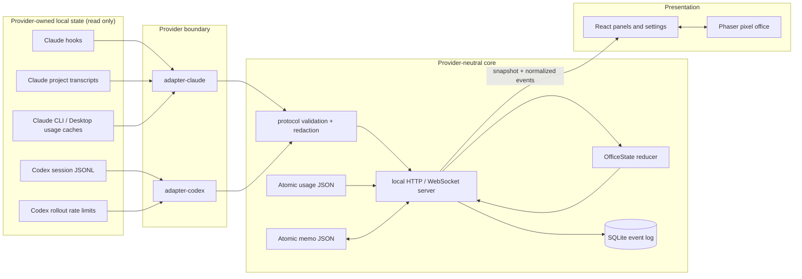
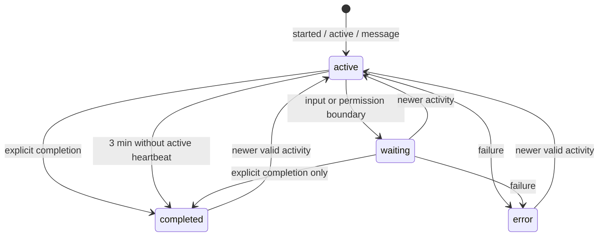
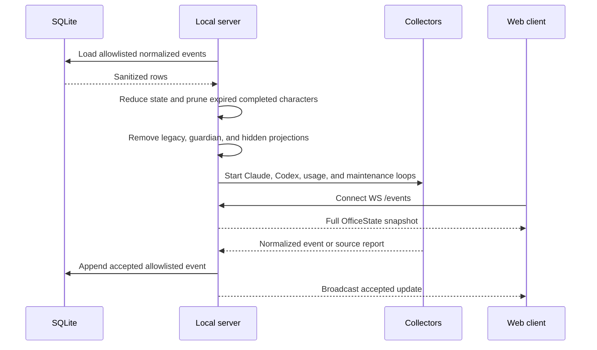

[English](ARCHITECTURE.md) | [한국어](docs/ARCHITECTURE.ko.md) | [日本語](docs/ARCHITECTURE.ja.md)

# Token Floor Architecture

This document describes Token Floor's current architecture.

## 1. Design goals

Token Floor is a local-first, read-only observability application for Claude Code and Codex. Four constraints shape the system:

1. **No additional authentication.** Token Floor does not add an account, OAuth flow, API-key field, or provider login. It observes local state owned by an already configured provider.
2. **Provider-neutral presentation.** Claude- and Codex-specific formats stop at their adapters. The server, persistence layer, React UI, and Phaser scene use shared protocol types only.
3. **Minimum retained data.** Raw provider records, reasoning, tool inputs/results, commands, credentials, guardian activity, and orchestration prompts do not cross the normalization boundary.
4. **Useful degraded operation.** Each provider, each usage source, the application socket, durable logs, and memos can fail or recover independently.

## 2. System overview



Only the adapter/collector layer touches provider-owned files. Normalized events enter one reducer, are persisted through an allowlist, and are broadcast to the browser. The browser never reads provider files or credentials.

## 3. Trust and data boundaries

| Zone                     | May read                                                                       | May emit or store                                                                      | Must not emit or store                                                                |
| ------------------------ | ------------------------------------------------------------------------------ | -------------------------------------------------------------------------------------- | ------------------------------------------------------------------------------------- |
| Claude collector/adapter | Claude settings, hook bodies, project transcript tails, supported usage caches | Structural identities, lifecycle state, sanitized visible text, normalized usage       | Raw prompt/tool fields, commands, tool results, sidechains, credentials               |
| Codex collector/adapter  | Recent session JSONL and rate-limit records                                    | Structural identities, payload-free activity, sanitized visible text, normalized usage | Reasoning text, invocation input/result, guardian/orchestration messages, credentials |
| Protocol/server          | Normalized candidate events                                                    | Allowlisted versioned events, projections, source status                               | Provider-specific payloads or unknown fields                                          |
| SQLite/JSON stores       | Normalized server data only                                                    | Sanitized events, normalized usage, user memos                                         | Provider originals or authentication material                                         |
| Web application          | HTTP snapshots, WebSocket normalized events, memo API                          | Locale/avatar browser preferences                                                      | Provider files, credentials, raw tool data                                            |

The server binds to `127.0.0.1`. This is a local process boundary, not a remote service boundary.
Requests must also use a numeric loopback `Host`. Browser mutations and WebSocket upgrades accept
only the configured Token Floor `Origin`; Claude hooks require JSON plus Token Floor's fixed,
non-simple observer header. These checks prevent an unrelated webpage from using CORS-free form
posts or WebSockets to read or mutate loopback state.

Provider working directories remain adapter-local. Each adapter converts `cwd` into a stable,
provider-scoped opaque project ID and a bounded display label. Absolute paths and local usernames
are not persisted or broadcast, and legacy persisted project IDs are re-projected through the same
boundary while loading.

## 4. Provider-neutral protocol

`packages/protocol` is the shared source of truth.

### Lifecycle events

- `agent.started`
- `agent.active`
- `agent.message`
- `agent.waiting`
- `agent.completed`
- `agent.failed`
- `usage.updated`

Each accepted event carries a stable `eventId`, schema version, provider, timestamp, and only the allowlisted fields for its event type. Agent projections use `active`, `waiting`, `completed`, or `error` status. Waiting reasons are limited to `input` and `permission`.

### Source health

Provider collection health is independent from agent state:

- `healthy`: a source produced a valid current observation;
- `waiting`: the source exists but no meaningful actor has been admitted yet;
- `missing`: the expected local source is absent;
- `stale`: collection failed but a last-known-good value remains usable;
- `malformed`: the source contains invalid data and collection continues safely;
- `disconnected`: the collector is not connected.

A syntactically valid but unsupported provider record is skipped; it does not become a malformed warning.

### Reduction and idempotency

The reducer keeps agents, usage, source conditions, chat messages, and non-chat events as separate projections. It deduplicates by stable event ID and rejects stale lifecycle updates that would roll an agent back. Chat and non-chat logs are bounded independently to 100 entries.



The three-minute inferred-completion rule applies only to active agents. Waiting and error states never time out into completion. Completed character projections expire after three hours, but their sanitized logs remain within the two 100-entry global bounds.

## 5. Claude integration

### 5.1 Local sources

The Claude path starts in `packages/adapter-claude` and its server collector. Supported local roots include:

- `~/.claude/settings.json` for hook/status-line configuration;
- `~/.claude/projects/**/*.jsonl` for bounded transcript recovery;
- supported cache files beneath `~/.claude` for CLI usage;
- `~/Library/Application Support/Claude/plan-usage-history.json`;
- `~/Library/Application Support/Claude/Cache/Cache_Data` for Claude Desktop usage responses.

Explicit path overrides are diagnostics and platform fallbacks, not the primary architecture.

### 5.2 Hook observation

Production `token-floor` CLI startup binds the loopback server and then idempotently ensures Claude observers for the resolved port. The explicit `token-floor install` command uses the same merge without starting the server, so it remains useful for preconfiguration or repair but is not required. Neither path creates a missing Claude directory. They preserve unrelated user settings, hooks, and user-owned status lines, create at most one recovery backup, and avoid rewriting unchanged settings. Automatic setup failures are reported without stopping the server or Codex observation.

Observed boundaries include session start, user prompt submission, pre/post tool use, tool failure, permission request, notification, subagent start/stop, stop/failure, and session end. Hooks post to:

```text
POST http://127.0.0.1:<resolved-port>/hooks/claude
POST http://127.0.0.1:<resolved-port>/hooks/claude-usage
```

Only structural fields select the session, agent kind, parent, status transition, and safe summary. Raw prompt text, tool input, command, tool result, and assistant body from the hook request are not projected.
The generated curl observer also sends a fixed `X-Token-Floor-Hook` header and JSON content type.
The header is not a provider credential; it makes the request non-simple so an unrelated browser
origin cannot forge it without a rejected preflight.

### 5.3 Main agents and subagents

The adapter builds a main identity from the Claude session and assigns stable subagent slots through a registry. Parent relationships, execution identity, and role are normalized. Stop completes an agent unless structural metadata says background work remains. Permission requests become `agent.waiting`; failures become `agent.failed`.

### 5.4 Transcript recovery and chat

Hooks establish that an actor is meaningful; transcripts enrich only those admitted actors. The collector polls recent project JSONL files on a bounded interval, reads at most a bounded tail, tolerates an incomplete first or last line, and ignores sidechains.

Visible user and assistant text is sanitized and normalized. Tool-use and tool-result blocks are excluded. This prevents internal transcript structure from becoming chat while still recovering readable context after the process starts late or restarts.

### 5.5 Claude usage

Claude usage can arrive from CLI cache entries, Claude Desktop HTTP cache entries matching the usage response, plan history, or a silent status-line handoff. Token Floor never replaces a user-owned status line. It installs its observer only when no user status line exists and never launches a helper Claude process.

The collector validates candidates, selects the newest valid sample, and—when samples fall within the same five-second refresh window—prefers the one containing more complete five-hour and weekly data. Used percentages are normalized into remaining percentages plus reset times.

## 6. Codex integration

### 6.1 Session discovery and bounded tailing

`packages/adapter-codex` observes `~/.codex/sessions/**/*.jsonl`. The server tracks recent files from the last 24 hours, bounded to 96 candidates, and polls tracked files every second.

An initial read combines a bounded prefix with a bounded tail so session metadata and recent activity are both available without loading a whole large rollout. Subsequent reads use an incremental cursor and retained remainder. Partial final lines wait for the next poll; truncation or replacement resets the cursor safely.

### 6.2 Identity and event decoding

`session_meta` supplies thread/session, working directory, main/subagent kind, parent/fork relation, and subagent role. Task boundaries, user/assistant messages, subagent activity, function calls, custom tool calls, MCP calls, and results are decoded into candidate observations.

Guardian subagents are excluded. User-role content belonging to a subagent is treated as internal orchestration and is also excluded.

### 6.3 Active heartbeats and waiting

The adapter normalizes `mcp_tool_call_begin`, `mcp_tool_call_end`, and `agent_reasoning` into provider-neutral `agent.active` events. These heartbeats contain no reasoning text, tool input, result, or invocation data. Their stable IDs are deduplicated through a bounded identity cache and again by the protocol reducer.

This heartbeat path is what prevents a busy Codex session from disappearing and being inferred complete after three minutes.

The decoder may inspect opaque local arguments only to identify structural `request_user_input` or `require_escalated` boundaries. It emits a normalized waiting reason, never the arguments themselves.

### 6.4 Codex chat and usage

Sanitized visible user and assistant messages can enter the chat log, up to the server's global 100-message projection. Only assistant messages are eligible for office speech bubbles.

For usage, the collector scans a bounded set of recent rollout files, reads a bounded tail, and selects recent `rate_limits` metadata. A five-hour window and a window of at least seven days are normalized separately. Remaining percentage is derived from provider-reported used percentage. No Codex authentication or helper CLI process is involved.

## 7. Server, transport, and maintenance

`packages/server` owns collection and the local application boundary.

### HTTP and WebSocket surface

| Route                      | Purpose                                                             |
| -------------------------- | ------------------------------------------------------------------- |
| `GET /health`              | Local server liveness                                               |
| `GET /snapshot`            | Full normalized office snapshot                                     |
| `/memos`                   | Versioned memo list/create/update/archive/restore/delete operations |
| `POST /hooks/claude`       | Claude lifecycle hook receiver                                      |
| `POST /hooks/claude-usage` | Silent Claude usage handoff                                         |
| `WS /events`               | Initial snapshot and incremental normalized events                  |

Production UI, HTTP API, WebSocket, and Claude hooks share the resolved `127.0.0.1` port. Resolution order is CLI flag, environment, installed config, then `10214`. Vite development uses `5173` and proxies same-origin API/WS traffic to the development server.
HTTP responses expose CORS only to that configured development origin. Memo mutations require the
exact origin, JSON bodies require `application/json`, and `/events` rejects WebSocket upgrades from
every other origin. Requests with a non-loopback `Host` are rejected to reduce DNS-rebinding risk.

### Startup sequence



Pruning before the first browser snapshot prevents a burst of old completed characters from appearing and then disappearing.

### Timers and bounds

| Work                                | Current bound or interval            |
| ----------------------------------- | ------------------------------------ |
| Codex tracked session poll          | 1 second                             |
| Claude transcript recovery          | 30 seconds                           |
| Provider usage refresh              | 15 seconds                           |
| Agent timeout/retention maintenance | 15 seconds                           |
| Active completion inference         | 3 minutes without a newer heartbeat  |
| Completed character retention       | 3 hours                              |
| Chat retention                      | latest 100 sanitized messages        |
| Event retention                     | latest 100 sanitized non-chat events |

Source reports are broadcast only when their meaningful condition, success time, or capability changes. One collector failure does not stop the other collectors.

## 8. Persistence

All runtime persistence lives in Git-ignored `.token-floor/`:

### `events.db`

SQLite stores accepted normalized events for restart recovery. Before append, the server projects each event through an allowlist and redaction pass. Load applies the same boundary again so legacy rows cannot reintroduce unknown or sensitive fields. Replaying restored events rebuilds the two bounded logs and current state; character expiration is then applied independently.

### `provider-usage.json`

Usage snapshots are written atomically only when changed. A missing, locked, partially written, or malformed provider source does not erase the last valid normalized snapshot.

### `memos.json`

The memo store is a separate versioned JSON document. Writes use a same-directory temporary file and atomic rename. Load and mutation results are ordered by `updatedAt` descending with memo ID as the deterministic tie breaker. Memo text is limited to 1–1,000 characters. Active memos support edit/archive; archived memos support restore/delete. It is intentionally unrelated to lifecycle logs and browser preferences.

## 9. Web and game architecture

### React application layer

React owns the header, status counters, usage cards, provider alerts, settings, locale/avatar preferences, character picker, memo panel, agent details, chat log, and event log. Shared `FloatingPanel` and `ActionIcon` primitives keep overlay behavior and styling consistent. Scrollable panel surfaces share thin translucent scrollbar styling with transparent tracks.

The WebSocket hook accepts a full snapshot first and then incremental normalized updates. On disconnect, it retains the last valid snapshot and reconnects with bounded backoff. Provider source health remains distinct from socket health.

### Phaser simulation layer

Phaser owns the pixel world, room textures, props, collisions, autonomous agents, player movement, camera, animation frames, and depth. The current layout has:

- upper-left agent workspace;
- upper-right meeting room with table and whiteboard;
- middle-right coffee lounge;
- lower-left sealed Codex and Claude usage offices;
- lower-right intentionally empty future zone.

Characters render at 32×32 pixels with compact 16×16 collision footprints. Movement is cardinal-only, uses horizontal or vertical legs to avoid staircase motion, and resolves against walls and retained solid props. The player starts in the meeting room and can move with WASD or arrows. Arrow events are captured globally for player ownership outside text entry. When an input, textarea, or editable element owns text entry, both arrows and WASD yield to the editor.

### DOM overlay layer

Agent labels, speech bubbles, and the accessible whiteboard tool live in DOM overlays projected from Phaser world coordinates. This keeps text readable and interactive while the pixel canvas remains crisp. The whiteboard has one accessible toggle path; it opens or closes the memo panel.

Speech priority is:

1. recent sanitized assistant message;
2. short lifecycle-transition phrase;
3. localized lounge idle phrase.

Non-completed agents in the workspace keep a visible bubble. Completed agents rotate a single lounge speaker every 10 seconds. Usage NPCs never speak.

## 10. Folder structure

```text
token-floor/
├── AGENTS.md                         # Repository development and safety rules
├── README.md                         # English product guide
├── ARCHITECTURE.md                   # English architecture guide
├── docs/
│   ├── README.ko.md                  # Korean product guide
│   ├── README.ja.md                  # Japanese product guide
│   ├── ARCHITECTURE.ko.md            # Korean architecture guide
│   ├── ARCHITECTURE.ja.md            # Japanese architecture guide
│   └── assets/                       # Documentation screenshots
├── packages/
│   ├── protocol/                     # Contracts, schemas, reducer, redaction, retention
│   ├── adapter-claude/               # Claude hooks, transcript and usage adapters
│   ├── adapter-codex/                # Codex session and usage adapters
│   ├── server/                       # HTTP/WS server, collectors and persistence
│   ├── cli/                          # Distribution CLI and lifecycle ownership
│   ├── web/                          # React UI and Phaser office
│   └── asset-contract/               # Asset manifest and validation
├── scripts/                          # Repository maintenance and asset tooling
├── .agents/private/                  # Git-ignored plans, references and asset sources
└── .token-floor/                     # Git-ignored runtime DB, usage cache and memos
```

Each package exposes explicit TypeScript boundaries. Production source is split by responsibility before 200 lines.

## 11. Technology stack

| Technology        | How Token Floor uses it                                                                                                                                             |
| ----------------- | ------------------------------------------------------------------------------------------------------------------------------------------------------------------- |
| TypeScript 6      | Strict shared contracts, adapter outputs, server projections, React props, and Phaser runtime types; workspace project references keep package boundaries explicit. |
| npm workspaces    | One repository with independently testable protocol, adapter, server, web, and asset-contract packages.                                                             |
| Node.js           | Loopback HTTP server, filesystem observers, JSONL tailing, atomic files, process lifecycle, and local runtime orchestration.                                        |
| `node:sqlite`     | Built-in synchronous SQLite persistence for small normalized event volumes and deterministic startup replay.                                                        |
| `ws`              | Local full-snapshot and incremental-event delivery between server and browser.                                                                                      |
| React 19          | Accessible panels, settings, tabs, memo CRUD, agent details, logs, alerts, and state-to-view composition.                                                           |
| Phaser 3          | Pixel office world, camera, sprite animation, routing, collisions, props, and depth sorting.                                                                        |
| Radix UI Tabs     | Keyboard- and screen-reader-aware tabs used by shared panels.                                                                                                       |
| Vite              | Fast local web development, ESM bundling, and production web build.                                                                                                 |
| Vitest            | Unit and regression coverage across decoders, normalizers, reducers, collectors, persistence, movement, layout, and UI logic.                                       |
| ESLint + Prettier | Static quality and repository-wide formatting, including Markdown documentation.                                                                                    |

## 12. Failure and recovery model

- **Provider missing:** show that provider as missing; keep the other provider live.
- **Partial JSONL write:** retain the fragment and retry on the next bounded poll.
- **Malformed record:** report malformed only for actual parse/validation failure; retain last valid state.
- **Usage source failure:** keep last-known-good normalized usage and mark it stale.
- **WebSocket interruption:** keep the current scene, reconnect, then replace it with the newest full snapshot.
- **Server restart:** replay sanitized SQLite events, rebuild bounded logs, prune expired completed characters, and reconnect collectors.
- **Duplicate observation:** stable identity plus reducer idempotency produces no duplicate log entry or renewed presentation timer.
- **Memo write failure:** preserve the previously valid JSON document; do not mix partially written data into lifecycle persistence.
