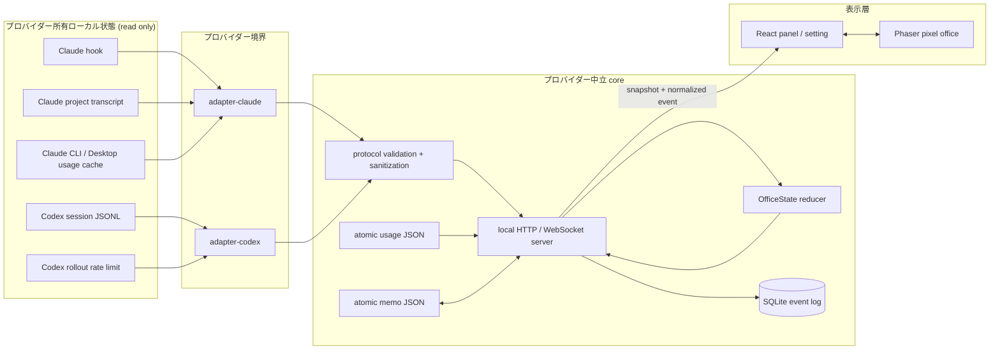
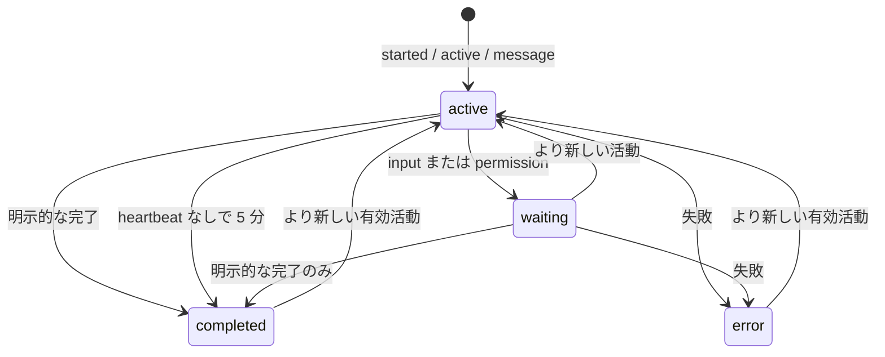
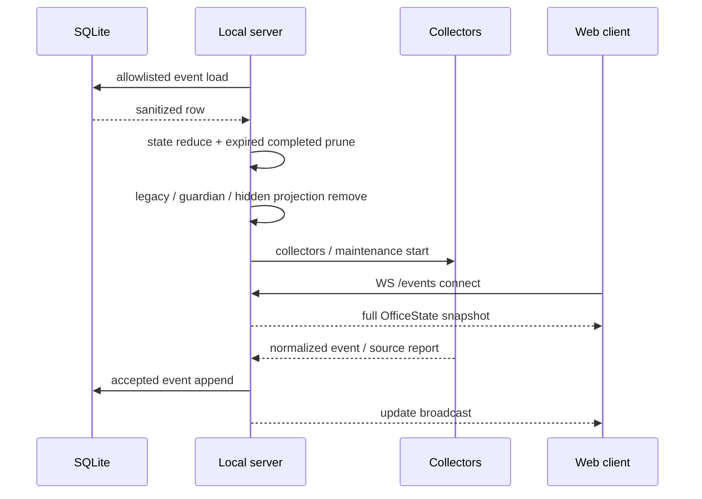

[English](../ARCHITECTURE.md) | [한국어](ARCHITECTURE.ko.md) | [日本語](ARCHITECTURE.ja.md)

# Token Floor アーキテクチャ

この文書は実装済みの Phase 00–04 を説明します。`npx`、CLI ライフサイクルコマンド、package provenance、クリーン環境のオンボーディング、全ブラウザー検証は Phase 05 の準備中項目です。

## 1. 設計目標

Token Floor は Claude Code と Codex のためのローカルファースト・読み取り専用オブザーバビリティアプリです。

1. **追加認証なし:** Token Floor アカウント、OAuth、API キー欄、再ログインを追加せず、設定済みプロバイダーが所有するローカル状態を観察します。
2. **プロバイダー中立な表示:** Claude・Codex 固有形式は adapter で終了します。server、永続化、React UI、Phaser scene は共通 protocol だけを使います。
3. **最小限の保持データ:** 生レコード、推論、tool 入出力、command、認証情報、guardian 活動、orchestration prompt は正規化境界を越えません。
4. **有用な縮退運転:** 各プロバイダー、usage source、app socket、ログ、メモは独立して失敗・復旧できます。

## 2. 全体構成



プロバイダー所有ファイルへ触れるのは adapter・collector 層だけです。正規化 event は一つの reducer に入り、許可リストを通して保存され、ブラウザーへ配信されます。ブラウザーはプロバイダーファイルや認証情報を読みません。

## 3. 信頼・データ境界

| 領域                     | 読み取り可能                                               | 出力・保存可能                                                  | 出力・保存禁止                                                                |
| ------------------------ | ---------------------------------------------------------- | --------------------------------------------------------------- | ----------------------------------------------------------------------------- |
| Claude collector/adapter | 設定、hook body、project transcript tail、対応 usage cache | 構造 ID、状態、サニタイズ済み表示文、正規化 usage               | prompt・tool 原文、command、tool result、sidechain、認証情報                  |
| Codex collector/adapter  | 最近の session JSONL、rate-limit record                    | 構造 ID、payload なしの活動、サニタイズ済み表示文、正規化 usage | reasoning、invocation input/result、guardian・orchestration message、認証情報 |
| Protocol/server          | 正規化 event 候補                                          | 許可リスト方式の versioned event、projection、source status     | プロバイダー固有 payload、未知 field                                          |
| SQLite/JSON              | 正規化済み server data                                     | サニタイズ済み event、正規化 usage、ユーザーメモ                | プロバイダー原文、認証素材                                                    |
| Web                      | HTTP snapshot、WebSocket event、memo API                   | locale・avatar preference                                       | プロバイダーファイル、認証情報、tool 原文                                     |

Server は `127.0.0.1` に bind します。リモートサービスではなく、ローカル process 境界です。

## 4. プロバイダー中立 protocol

共通 source of truth は `packages/protocol` です。

### ライフサイクル event

`agent.started`、`agent.active`、`agent.message`、`agent.waiting`、`agent.completed`、`agent.failed`、`usage.updated` を使います。各 event には安定した `eventId`、schema version、provider、timestamp と種類別の許可 field だけが入ります。Agent 状態は `active`、`waiting`、`completed`、`error`、待機理由は `input`、`permission` に限定されます。

### Source 状態

- `healthy`: 有効な最新観察を取得
- `waiting`: source はあるが意味のある actor が未確定
- `missing`: 想定した local source がない
- `stale`: 収集は失敗したが最後の正常値を利用可能
- `malformed`: 不正データがあるが安全に収集を継続
- `disconnected`: collector が未接続

構文上有効でも未対応のレコードは静かにスキップし、`malformed` にはしません。

### Reducer と冪等性

Reducer は agent、usage、source 状態、chat、非 chat event を別々の projection として管理します。安定 event ID で重複を除き、古い lifecycle event による状態の巻き戻しを防ぎます。Chat と非 chat event は独立して最新 100 件に制限します。



5 分の完了推定は `active` のみに適用します。`waiting` と `error` は timeout で完了しません。完了 character projection は 60 分後に削除しますが、サニタイズ済みログは二つのグローバル 100 件制限の中で保持します。

## 5. Claude 連携

### 5.1 ローカルソース

Claude の経路は `packages/adapter-claude` と server collector から始まります。

- `~/.claude/settings.json`: hook・status line 設定
- `~/.claude/projects/**/*.jsonl`: bounded transcript 復元
- `~/.claude` 配下の対応 cache: CLI usage
- `~/Library/Application Support/Claude/plan-usage-history.json`
- `~/Library/Application Support/Claude/Cache/Cache_Data`: Claude Desktop usage response

明示的 path override は診断・platform fallback であり、基本構成ではありません。

### 5.2 Hook 観察

自動観察を無効にしていなければ、server 起動時に Claude 設定へ loopback observer を冪等に merge します。既存設定と hook を保ち、復旧 backup は一度だけ作成し、短く失敗許容の local POST を使うため Token Floor 停止中も Claude をブロックしません。

Session start、user prompt submit、tool 前後、tool failure、permission request、notification、subagent start/stop、stop/failure、session end を観察します。

```text
POST http://127.0.0.1:4317/hooks/claude
POST http://127.0.0.1:4317/hooks/claude-usage
```

構造 field だけで session、agent 種別、parent、状態遷移、安全な要約を決めます。Hook request 内の prompt、tool input、command、tool result、assistant body は projection しません。

### 5.3 メイン・サブエージェント

Claude session から main ID を作り、registry で安定 subagent slot を割り当てます。Parent、execution ID、role を正規化します。Background 作業が残るという構造 metadata がなければ Stop は完了、permission request は `agent.waiting`、失敗は `agent.failed` です。

### 5.4 Transcript 復元とチャット

Hook が意味のある actor を先に確定し、transcript は確定済み actor だけを補完します。Collector は最近の project JSONL を bounded interval・tail で読み、先頭・末尾の不完全行を安全に扱い、sidechain を除外します。

表示可能な user・assistant text だけをサニタイズ・正規化し、tool-use・tool-result block を除外します。開始が遅れたり再起動した場合も読める文脈を復元しつつ、内部 transcript 構造は chat にしません。

### 5.5 Claude 使用量

CLI cache、Claude Desktop HTTP cache の usage response、plan history、静かな status-line handoff を利用できます。ユーザー所有 status line は置き換えず、存在しない場合だけ observer を入れます。使用量更新のための補助 Claude process は起動しません。

候補を検証して最新の有効 sample を選び、5 秒以内の sample 間では 5 時間・週間情報がより完全なものを優先します。使用率を残り比率と reset 時刻へ正規化します。

## 6. Codex 連携

### 6.1 Session 発見・bounded tailing

`packages/adapter-codex` は `~/.codex/sessions/**/*.jsonl` を観察します。Server は過去 24 時間のファイルを最大 96 件追跡し、1 秒ごとに確認します。

初回 read は bounded prefix と tail を組み合わせ、大きな rollout 全体を読まずに session metadata と最近の活動を取得します。以後は cursor と残 fragment を使います。不完全な末尾行は次の poll まで保持し、truncate・replace 時には安全に cursor を reset します。

### 6.2 ID・event decode

`session_meta` から thread/session、作業ディレクトリ、main/subagent、parent/fork、subagent role を得ます。Task 境界、user・assistant message、subagent 活動、function・custom tool・MCP call/result を候補観察に decode します。

Guardian subagent と、subagent に属する user-role の内部 orchestration content は除外します。

### 6.3 Active heartbeat・待機

`mcp_tool_call_begin`、`mcp_tool_call_end`、`agent_reasoning` をプロバイダー中立の `agent.active` に正規化します。Reasoning text、tool input/result、invocation data は含めません。安定 ID は bounded decoder cache と protocol reducer の両方で deduplicate されます。この経路が、実際に作業中の Codex session が 5 分後に誤って完了扱いされる問題を防ぎます。

Decoder は構造的な `request_user_input`、`require_escalated` 境界を見つける場合にだけ local opaque argument を調べられます。出力は正規化待機理由だけで、argument 本体は境界を越えません。

### 6.4 Codex チャット・使用量

サニタイズ済み user・assistant message はグローバル最新 100 件の chat projection に入ります。オフィスの吹き出しに使えるのは assistant message だけです。

Usage collector は bounded recent rollout と tail から `rate_limits` metadata を選びます。5 時間 window と 7 日以上の window を別々に正規化し、provider が報告した使用率から残り比率を求めます。Codex 認証や補助 CLI process は使いません。

## 7. Server・転送・maintenance

`packages/server` が収集とローカルアプリ境界を所有します。

### HTTP・WebSocket インターフェース

| Route                      | 役割                                           |
| -------------------------- | ---------------------------------------------- |
| `GET /health`              | local server liveness                          |
| `GET /snapshot`            | 完全な normalized office snapshot              |
| `/memos`                   | memo list/create/update/archive/restore/delete |
| `POST /hooks/claude`       | Claude lifecycle hook receiver                 |
| `POST /hooks/claude-usage` | Claude usage handoff                           |
| `WS /events`               | 初回 snapshot と incremental event             |

Server は `127.0.0.1:4317`、Vite 開発 UI は `127.0.0.1:5173` です。

### 起動シーケンス



最初の browser snapshot より前に期限切れ character を削除するため、古い完了エージェントが大量に現れてすぐ消えることはありません。

### 間隔と上限

| 処理                                 | 現在の間隔・上限              |
| ------------------------------------ | ----------------------------- |
| Codex session poll                   | 1 秒                          |
| Claude transcript 復元               | 30 秒                         |
| provider usage refresh               | 15 秒                         |
| agent timeout・retention maintenance | 15 秒                         |
| active completion inference          | 新しい heartbeat なしで 5 分  |
| completed character retention        | 60 分                         |
| chat retention                       | sanitized latest 100          |
| event retention                      | sanitized non-chat latest 100 |

意味のある condition、success time、capability が変わった場合だけ source report を配信します。一つの collector failure は他を停止させません。

## 8. 永続化

すべての runtime store は Git 対象外の `.token-floor/` にあります。

### `events.db`

許可済み normalized event を SQLite に保存します。Append 前と load 時の両方で allowlist・redaction を適用し、legacy row の未知・機密 field も遮断します。Replay で二つの bounded log と current state を復元し、その後 character expiration を独立適用します。

### `provider-usage.json`

変更された normalized usage だけを atomic write します。Source の missing、lock、partial write、malformed でも last-known-good snapshot を消しません。

### `memos.json`

独立した versioned memo document です。同一 directory の temp file と atomic rename を使います。Text は 1–1,000 文字、active memo は edit/archive、archived memo は restore/delete が可能です。

## 9. Web・ゲーム構成

### React 層

React は header、status count、usage card、provider alert、settings、locale・avatar preference、character picker、memo、agent detail、chat、event panel を担当します。共通 `FloatingPanel` と `ActionIcon` primitive で overlay の動作・style を統一します。

WebSocket hook は full snapshot の後に incremental event を適用します。切断時も最後の有効 snapshot を保持し、bounded backoff で再接続します。Provider source health と socket health は別です。

### Phaser 層

Phaser は pixel world、room texture、prop、collision、autonomous agent、player movement、camera、frame animation、depth を担当します。現在は左上 workspace、右上 meeting room、右中央 lounge、左下の分離 Codex・Claude usage office、右下 future zone です。

Character は 32×32 pixel 表示と 16×16 collision footprint を使います。移動は cardinal-only で、壁と許可された solid prop を避けます。Player は meeting room から始まり WASD・矢印キーで移動します。矢印は global に player が所有し、WASD は text 入力中だけ譲ります。

### DOM overlay 層

Agent label、speech bubble、accessible whiteboard tool は Phaser world 座標から DOM へ projection します。Text の可読性・操作性と鮮明な pixel canvas を両立します。Whiteboard は一つの accessible toggle path だけを持ち、memo panel を開閉します。

吹き出しは、最近の sanitized assistant message、短い state transition、localized lounge idle phrase の順で優先します。未完了 agent が workspace にいる間は吹き出しを保持します。完了 agent は 10 秒ごとに一人だけ話し、usage NPC は話しません。

## 10. フォルダー構成

```text
token-floor/
├── AGENTS.md
├── README.md / ARCHITECTURE.md
├── docs/                         # KO・JA docs and screenshots
├── packages/
│   ├── protocol/                 # contracts, schemas, reducer, redaction, retention
│   ├── adapter-claude/           # Claude hook, transcript, usage
│   ├── adapter-codex/            # Codex session, usage
│   ├── server/                   # HTTP/WS, collectors, persistence
│   ├── web/                      # React UI, Phaser office
│   └── asset-contract/           # asset manifest / validation
├── scripts/                      # maintenance / asset tooling
├── .agents/private/              # Git-ignored plans, references, asset sources
└── .token-floor/                 # Git-ignored DB, usage cache, memos
```

## 11. 技術スタック

| 技術             | Token Floor での用途                                                                                         |
| ---------------- | ------------------------------------------------------------------------------------------------------------ |
| TypeScript 6     | strict contracts、adapter output、server projection、React props、Phaser runtime types と project references |
| npm workspaces   | protocol、adapter、server、web、asset package の独立検証                                                     |
| Node.js          | loopback HTTP、filesystem observation、JSONL tail、atomic file、local process lifecycle                      |
| `node:sqlite`    | 少量の normalized event を built-in SQLite に保存し deterministic replay                                     |
| `ws`             | server・browser 間の full snapshot と incremental event                                                      |
| React 19         | accessible panel、settings、tabs、memo CRUD、agent detail、logs、alerts                                      |
| Phaser 3         | pixel world、camera、sprite animation、routing、collision、props、depth sorting                              |
| Radix UI Tabs    | keyboard・screen reader 対応の shared panel tabs                                                             |
| Vite             | 高速 local dev、ESM bundle、production web build                                                             |
| Vitest           | decoder、normalizer、reducer、collector、persistence、movement、layout、UI regression tests                  |
| ESLint・Prettier | static quality と Markdown を含む repository formatting                                                      |

## 12. 障害・復旧モデル

- Provider missing はその provider だけを `missing` にし、もう一方を継続します。
- JSONL partial write は fragment を保持して次回 poll で続けます。
- 実際の parse・validation failure だけを `malformed` とし、最後の有効状態を保持します。
- Usage source failure は last-known-good usage を維持し `stale` にします。
- WebSocket 切断時は scene を保って再接続し、最新 full snapshot へ置き換えます。
- Server restart は SQLite replay、bounded logs 復元、expired character prune の順です。
- Duplicate observation は stable ID と reducer idempotency により log や UI timer を増やしません。
- Memo write failure は以前の valid JSON を保持します。

## 13. Phase 境界

Phase 00–04 は上記構成を提供します。Phase 05 の CLI・`npx`、install diagnostics・uninstall、clean environment onboarding、npm package・provenance、third-party source・license、supply-chain、Chrome・Edge・Firefox・Safari 検証は**準備中**です。
