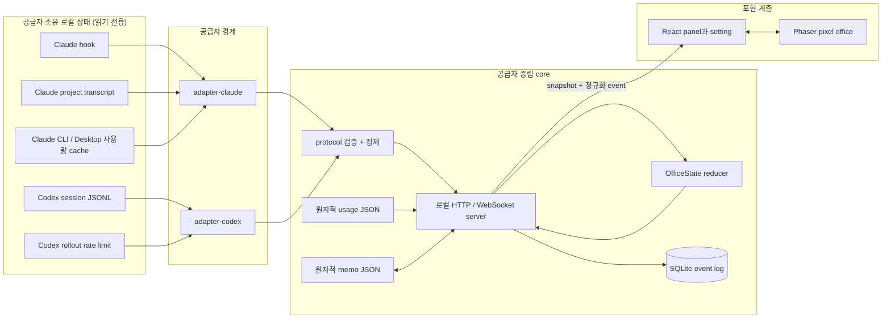
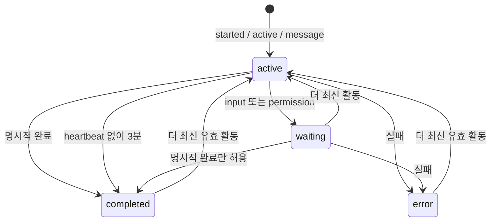
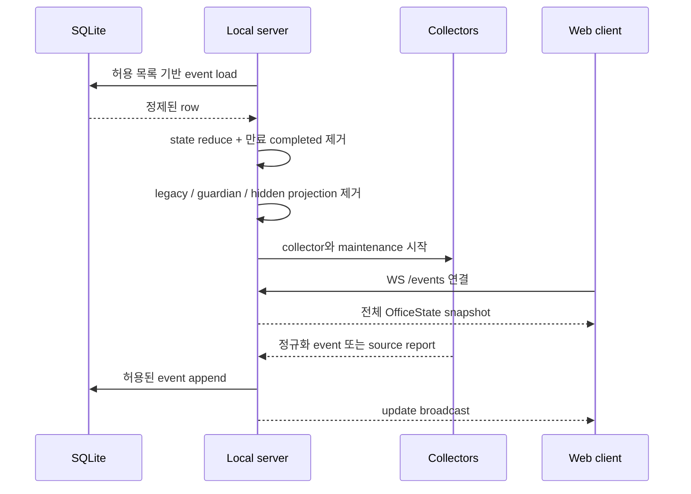

[English](../ARCHITECTURE.md) | [한국어](ARCHITECTURE.ko.md) | [日本語](ARCHITECTURE.ja.md)

# Token Floor 아키텍처

이 문서는 Token Floor의 현재 아키텍처를 설명합니다.

## 1. 설계 목표

Token Floor는 Claude Code와 Codex를 위한 로컬 우선·읽기 전용 관찰 애플리케이션입니다.

1. **추가 인증 없음:** Token Floor 계정, OAuth, API 키 입력, 공급자 재로그인 없이 이미 설정된 공급자 소유 로컬 상태를 관찰합니다.
2. **공급자 중립 표현:** Claude·Codex 전용 형식은 adapter까지만 존재합니다. 서버, 영속성, React UI, Phaser 장면은 공통 protocol만 사용합니다.
3. **최소 데이터 보존:** 공급자 원문, 추론, 도구 입력·결과, 명령어, 인증정보, guardian 활동, orchestration prompt는 정규화 경계를 넘지 않습니다.
4. **유용한 성능 저하:** 각 공급자, 사용량 소스, 앱 socket, 로그, 메모가 서로 독립적으로 실패하고 복구될 수 있습니다.

## 2. 전체 구조



공급자 소유 파일에 접근하는 계층은 adapter·collector뿐입니다. 정규화된 event는 하나의 reducer로 들어가 허용 목록을 거쳐 저장되고 브라우저에 전송됩니다. 브라우저는 공급자 파일이나 인증정보를 읽지 않습니다.

## 3. 신뢰·데이터 경계

| 영역                     | 읽을 수 있는 데이터                                        | 방출·저장할 수 있는 데이터                                   | 방출·저장 금지 데이터                                                       |
| ------------------------ | ---------------------------------------------------------- | ------------------------------------------------------------ | --------------------------------------------------------------------------- |
| Claude collector/adapter | 설정, hook body, project transcript tail, 지원 usage cache | 구조적 ID, 상태, 정제된 표시 문구, 정규화 usage              | prompt·tool 원문, command, tool result, sidechain, 인증정보                 |
| Codex collector/adapter  | 최근 session JSONL, rate-limit record                      | 구조적 ID, payload 없는 활동, 정제된 표시 문구, 정규화 usage | reasoning, invocation input/result, guardian·orchestration 메시지, 인증정보 |
| Protocol/server          | 정규화 후보 event                                          | 허용 목록 기반 version event, projection, source status      | 공급자 전용 payload, 알 수 없는 field                                       |
| SQLite/JSON              | 정규화된 server data                                       | 정제 event, 정규화 usage, 사용자 memo                        | 공급자 원문, 인증자료                                                       |
| Web                      | HTTP snapshot, WebSocket event, memo API                   | locale·avatar browser preference                             | 공급자 파일, 인증정보, tool 원문                                            |

서버는 `127.0.0.1`에 바인딩합니다. 원격 서비스가 아니라 로컬 process 경계입니다.
요청의 `Host`도 숫자 loopback 주소여야 합니다. 브라우저 mutation과 WebSocket upgrade는
설정된 Token Floor `Origin`만 허용하며, Claude hook은 JSON과 Token Floor 전용의 고정된
non-simple observer header를 함께 요구합니다. 따라서 무관한 웹페이지가 CORS 없는 form
POST나 WebSocket으로 loopback 상태를 읽거나 바꿀 수 없습니다.

공급자의 작업 directory는 adapter 내부에만 남습니다. 각 adapter는 `cwd`를 안정적이고
provider-scoped인 opaque project ID와 길이가 제한된 표시 label로 바꿉니다. 절대 경로와
로컬 사용자명은 저장하거나 broadcast하지 않으며, legacy 저장 project ID도 load할 때 같은
경계를 다시 적용합니다.

## 4. 공급자 중립 protocol

`packages/protocol`이 공통 기준입니다.

### 생명주기 event

`agent.started`, `agent.active`, `agent.message`, `agent.waiting`, `agent.completed`, `agent.failed`, `usage.updated`만 사용합니다. 각 event에는 안정적인 `eventId`, schema version, provider, timestamp와 종류별 허용 field만 포함됩니다. Agent 상태는 `active`, `waiting`, `completed`, `error`이며 대기 사유는 `input`, `permission`으로 제한합니다.

### Source 상태

- `healthy`: 유효한 최신 관찰값을 얻음
- `waiting`: source는 있으나 의미 있는 actor가 아직 없음
- `missing`: 예상 local source가 없음
- `stale`: 수집은 실패했지만 마지막 정상 값을 사용할 수 있음
- `malformed`: 유효하지 않은 데이터가 있으나 안전하게 계속 수집함
- `disconnected`: collector 연결이 끊김

문법상 유효하지만 지원하지 않는 공급자 record는 조용히 건너뜁니다. `malformed`로 표시하지 않습니다.

### Reducer와 멱등성

Reducer는 agent, usage, source 상태, chat, 비채팅 event를 서로 다른 projection으로 관리합니다. 안정적인 event ID로 중복을 제거하고, 오래된 생명주기 event가 최신 agent 상태를 되돌리지 못하게 합니다. Chat과 비채팅 event는 각각 최근 100개로 독립 제한합니다.



3분 완료 추론은 `active`에만 적용합니다. `waiting`, `error`는 timeout으로 완료되지 않습니다. 완료 캐릭터 projection은 60분 후 제거하지만, 정제된 로그는 두 개의 전역 100개 제한 안에서 계속 유지합니다.

## 5. Claude 연동

### 5.1 로컬 소스

Claude 경로는 `packages/adapter-claude`와 server collector에서 시작합니다.

- `~/.claude/settings.json`: hook·status line 설정
- `~/.claude/projects/**/*.jsonl`: 제한된 transcript 복구
- `~/.claude` 아래 지원 cache: CLI usage
- `~/Library/Application Support/Claude/plan-usage-history.json`
- `~/Library/Application Support/Claude/Cache/Cache_Data`: Claude Desktop usage 응답

명시적인 경로 override는 진단·platform fallback일 뿐 기본 구조가 아닙니다.

### 5.2 Hook 관찰

Production `token-floor` CLI는 loopback server를 연 뒤 결정된 port에 맞춰 Claude observer를 멱등하게 준비합니다. 명시적 `token-floor install`은 server를 시작하지 않고 같은 병합을 수행하므로 사전 설정이나 복구에 사용할 수 있지만 필수는 아닙니다. 두 경로 모두 Claude directory가 없으면 새로 만들지 않습니다. 관련 없는 사용자 설정, hook, 사용자 소유 status line을 보존하고 복구 backup은 최대 한 번만 만들며, 설정이 바뀌지 않으면 파일을 다시 쓰지 않습니다. 자동 설정에 실패해도 오류를 알린 뒤 server와 Codex 관찰을 계속합니다.

Session start, user prompt submit, tool 전·후, tool failure, permission request, notification, subagent start·stop, stop·failure, session end 경계를 관찰합니다.

```text
POST http://127.0.0.1:<resolved-port>/hooks/claude
POST http://127.0.0.1:<resolved-port>/hooks/claude-usage
```

구조적 field만 session, agent 종류, parent, 상태 전환, 안전한 요약을 결정합니다. Hook request의 prompt, tool input, command, tool result, assistant body 원문은 projection하지 않습니다.
생성된 curl observer는 고정 `X-Token-Floor-Hook` header와 JSON content type도 전송합니다.
이 header는 공급자 credential이 아니라 요청을 non-simple로 만들어, 무관한 browser origin이
거부되는 preflight 없이 hook을 위조하지 못하게 하는 경계입니다.

### 5.3 메인·서브에이전트

Claude session으로 main ID를 만들고 registry로 안정적인 subagent slot을 할당합니다. Parent 관계, execution ID, 역할을 정규화합니다. 구조적 metadata에 background 작업이 남았다고 표시되지 않는 한 Stop은 완료이며, permission request는 `agent.waiting`, 실패는 `agent.failed`가 됩니다.

### 5.4 Transcript 복구와 채팅

Hook이 의미 있는 actor를 먼저 확정하고 transcript는 확정된 actor만 보강합니다. Collector는 최근 project JSONL을 제한된 주기로 읽고, tail 크기를 제한하며, 첫 줄·마지막 줄이 불완전해도 안전하게 처리하고 sidechain을 제외합니다.

표시 가능한 user·assistant text만 정제해 정규화합니다. Tool-use·tool-result block은 제외합니다. 늦게 시작하거나 재시작해도 읽을 수 있는 문맥은 복구하되 내부 transcript 구조는 채팅이 되지 않습니다.

### 5.5 Claude 사용량

CLI cache, Claude Desktop HTTP cache의 usage 응답, plan history, 조용한 status-line handoff를 지원합니다. 사용자 status line은 절대 교체하지 않으며, 사용자 설정이 없을 때만 observer를 설치합니다. 사용량 갱신을 위해 보조 Claude process를 실행하지 않습니다.

후보를 검증해 가장 최신의 유효 표본을 고르고, 5초 이내 표본끼리는 5시간·주간 정보가 더 완전한 값을 우선합니다. 사용 비율은 남은 비율과 reset 시각으로 정규화합니다.

## 6. Codex 연동

### 6.1 Session 발견·제한 tailing

`packages/adapter-codex`는 `~/.codex/sessions/**/*.jsonl`을 관찰합니다. Server는 최근 24시간 파일을 최대 96개까지 추적하고 1초마다 확인합니다.

첫 read는 제한된 prefix와 tail을 결합해 큰 rollout 전체를 읽지 않고도 session metadata와 최근 활동을 얻습니다. 다음 read부터 cursor와 남은 fragment를 사용합니다. 마지막 불완전한 줄은 다음 poll까지 보류하며 파일이 줄거나 교체되면 안전하게 cursor를 초기화합니다.

### 6.2 ID·event 해석

`session_meta`에서 thread/session, 작업 디렉터리, main/subagent, parent/fork, subagent 역할을 얻습니다. Task 경계, user·assistant message, subagent 활동, function·custom tool·MCP call과 result를 후보 관찰값으로 해석합니다.

Guardian subagent는 제외합니다. Subagent 소속 user-role content도 내부 orchestration으로 보고 제외합니다.

### 6.3 활동 heartbeat·대기

`mcp_tool_call_begin`, `mcp_tool_call_end`, `agent_reasoning`은 공급자 중립 `agent.active`로 정규화합니다. Reasoning text, tool input, result, invocation data는 포함하지 않습니다. 안정적 ID는 제한된 decoder cache와 protocol reducer에서 두 번 중복 제거됩니다. 이 경로가 실제 작업 중인 Codex session의 3분 완료 오판을 방지합니다.

Decoder는 구조적인 `request_user_input`, `require_escalated` 경계를 알아내는 데만 로컬 opaque argument를 검사할 수 있습니다. 방출하는 값은 정규화된 대기 사유뿐이며 argument 자체는 경계를 넘지 않습니다.

### 6.4 Codex 채팅·사용량

정제된 user·assistant message는 전역 최근 100개 chat projection에 들어갈 수 있습니다. 오피스 말풍선에는 assistant message만 사용합니다.

사용량 collector는 제한된 최근 rollout 파일과 tail만 읽어 `rate_limits` metadata를 선택합니다. 5시간 window와 7일 이상 window를 각각 정규화하고, 공급자가 보고한 사용 비율로 남은 비율을 계산합니다. Codex 인증이나 보조 CLI process는 사용하지 않습니다.

## 7. Server·전송·maintenance

`packages/server`가 수집과 로컬 앱 경계를 소유합니다.

### HTTP·WebSocket 인터페이스

| Route                      | 역할                               |
| -------------------------- | ---------------------------------- |
| `GET /health`              | 로컬 server 생존 확인              |
| `GET /snapshot`            | 전체 정규화 office snapshot        |
| `/memos`                   | memo 목록·생성·수정·보관·복원·삭제 |
| `POST /hooks/claude`       | Claude lifecycle hook 수신         |
| `POST /hooks/claude-usage` | Claude usage handoff 수신          |
| `WS /events`               | 최초 snapshot과 이후 정규화 event  |

Production UI, HTTP API, WebSocket, Claude hook은 결정된 하나의 `127.0.0.1` port를 공유합니다. 우선순위는 CLI flag, environment, 설치 config, `10214`입니다. Vite 개발 UI는 `5173`을 사용하고 API·WS를 개발 server로 proxy합니다.
HTTP CORS는 설정된 개발 origin에만 노출됩니다. Memo mutation은 정확한 origin을 요구하고,
JSON body는 `application/json`이어야 하며, `/events`는 다른 모든 origin의 WebSocket upgrade를
거부합니다. DNS rebinding 위험을 줄이기 위해 loopback이 아닌 `Host` 요청도 거부합니다.

### 시작 순서



첫 browser snapshot 전에 만료 캐릭터를 제거하므로 예전 완료 에이전트가 한꺼번에 나타났다 사라지지 않습니다.

### 주기와 제한

| 작업                           | 현재 주기·제한             |
| ------------------------------ | -------------------------- |
| Codex session poll             | 1초                        |
| Claude transcript 복구         | 30초                       |
| 공급자 usage 갱신              | 15초                       |
| agent timeout·보존 maintenance | 15초                       |
| active 완료 추론               | 더 최신 heartbeat 없이 3분 |
| 완료 캐릭터 보존               | 60분                       |
| chat 보존                      | 정제된 최근 100개          |
| event 보존                     | 정제된 비채팅 최근 100개   |

의미 있는 상태, 성공 시각, capability가 변할 때만 source report를 전송합니다. 한 collector의 실패가 다른 collector를 중단시키지 않습니다.

## 8. 영속성

모든 runtime 저장소는 Git에서 제외된 `.token-floor/`에 있습니다.

### `events.db`

허용된 정규화 event를 SQLite에 저장합니다. Append 전 allowlist·redaction을 적용하고 load할 때 다시 적용해 legacy row의 알 수 없는 민감 field도 차단합니다. Replay로 두 제한 로그와 현재 상태를 복구한 뒤 캐릭터 만료를 별도로 적용합니다.

### `provider-usage.json`

변경된 정규화 usage만 원자적으로 씁니다. Source가 없거나 잠기거나 부분 기록되거나 손상되어도 마지막 정상 snapshot을 지우지 않습니다.

### `memos.json`

별도의 versioned memo 문서입니다. 같은 디렉터리의 temp file과 atomic rename을 사용합니다. Text는 1–1,000자이며 active memo는 수정·보관, archived memo는 복원·삭제가 가능합니다.

## 9. Web·게임 구조

### React 계층

React는 header, status count, usage card, provider alert, 설정, locale·avatar preference, 캐릭터 선택, memo, agent 상세, chat, event panel을 담당합니다. 공통 `FloatingPanel`, `ActionIcon` primitive로 overlay 동작과 style을 통일합니다.

WebSocket hook은 전체 snapshot을 먼저 받고 incremental event를 적용합니다. 연결이 끊겨도 마지막 유효 snapshot을 유지하고 제한된 backoff로 재연결합니다. Provider source 상태와 socket 상태는 별개입니다.

### Phaser 계층

Phaser는 pixel world, room texture, prop, collision, autonomous agent, player movement, camera, frame animation, depth를 담당합니다. 현재는 좌상단 workspace, 우상단 meeting room, 우측 중앙 lounge, 좌하단의 분리된 Codex·Claude usage office, 우하단 future zone으로 구성됩니다.

캐릭터는 32×32 pixel로 표시하고 16×16 collision footprint를 사용합니다. 이동은 직교 방향만 허용하며 벽과 승인된 solid prop을 피합니다. Player는 meeting room에서 시작하고 WASD·방향키로 이동합니다. 방향키는 텍스트 입력 외부에서 player가 전역으로 소유합니다. input, textarea, 편집 가능 요소가 텍스트 입력을 소유하는 동안에는 방향키와 WASD 모두 편집기에 양보합니다.

### DOM overlay 계층

Agent label, speech bubble, 접근 가능한 whiteboard tool은 Phaser world 좌표를 DOM으로 projection합니다. Text는 읽기 쉽고 상호작용 가능하면서 pixel canvas는 선명하게 유지됩니다. Whiteboard에는 하나의 접근 가능한 toggle 경로만 있으며 memo panel을 열고 닫습니다.

말풍선 우선순위는 정제된 최근 assistant message, 짧은 상태 전환 문구, 번역된 lounge 휴식 문구 순입니다. 미완료 agent가 workspace에 있으면 말풍선을 유지합니다. 완료 agent는 10초마다 한 명만 말하고 usage NPC는 말하지 않습니다.

## 10. 폴더 구조

```text
token-floor/
├── AGENTS.md
├── README.md / ARCHITECTURE.md
├── docs/                         # KO·JA 문서와 screenshot
├── packages/
│   ├── protocol/                 # contract, schema, reducer, redaction, retention
│   ├── adapter-claude/           # Claude hook, transcript, usage
│   ├── adapter-codex/            # Codex session, usage
│   ├── server/                   # HTTP/WS, collector, persistence
│   ├── cli/                      # 배포 CLI·lifecycle 소유권
│   ├── web/                      # React UI, Phaser office
│   └── asset-contract/           # asset manifest·validation
├── scripts/                      # maintenance·asset tooling
├── .agents/private/              # Git 제외 plan·reference·asset source
└── .token-floor/                 # Git 제외 DB·usage cache·memo
```

## 11. 기술 스택

| 기술            | 사용 방식                                                                                               |
| --------------- | ------------------------------------------------------------------------------------------------------- |
| TypeScript 6    | strict contract, adapter output, server projection, React prop, Phaser runtime type과 project reference |
| npm workspaces  | protocol, adapter, server, web, asset package를 하나의 repository에서 독립 검증                         |
| Node.js         | loopback HTTP, filesystem 관찰, JSONL tail, atomic file, local process lifecycle                        |
| `node:sqlite`   | 적은 양의 정규화 event를 내장 SQLite로 저장하고 결정론적으로 replay                                     |
| `ws`            | server와 browser 사이의 전체 snapshot·incremental event 전송                                            |
| React 19        | 접근 가능한 panel, setting, tab, memo CRUD, agent detail, log, alert                                    |
| Phaser 3        | pixel world, camera, sprite animation, routing, collision, prop, depth sorting                          |
| Radix UI Tabs   | keyboard·screen reader를 고려한 공통 panel tab                                                          |
| Vite            | 빠른 local dev, ESM bundle, production web build                                                        |
| Vitest          | decoder, normalizer, reducer, collector, persistence, movement, layout, UI 회귀 test                    |
| ESLint·Prettier | 정적 품질과 Markdown을 포함한 repository format                                                         |

## 12. 실패·복구 모델

- 공급자가 없으면 해당 공급자만 `missing`으로 표시합니다.
- JSONL 일부만 기록되면 fragment를 보관하고 다음 poll에서 이어 읽습니다.
- 실제 parse·validation 실패만 `malformed`이며 마지막 유효 상태를 유지합니다.
- Usage source 실패 시 마지막 정규화 usage를 유지하고 `stale`로 표시합니다.
- WebSocket 단절 시 장면을 유지한 채 재연결하고 최신 전체 snapshot으로 교체합니다.
- Server 재시작 시 SQLite를 replay하고 로그를 복구한 뒤 만료 캐릭터를 제거합니다.
- 중복 관찰은 안정적 ID와 reducer 멱등성으로 로그나 UI timer를 다시 만들지 않습니다.
- Memo write 실패 시 이전 정상 JSON을 보존합니다.
