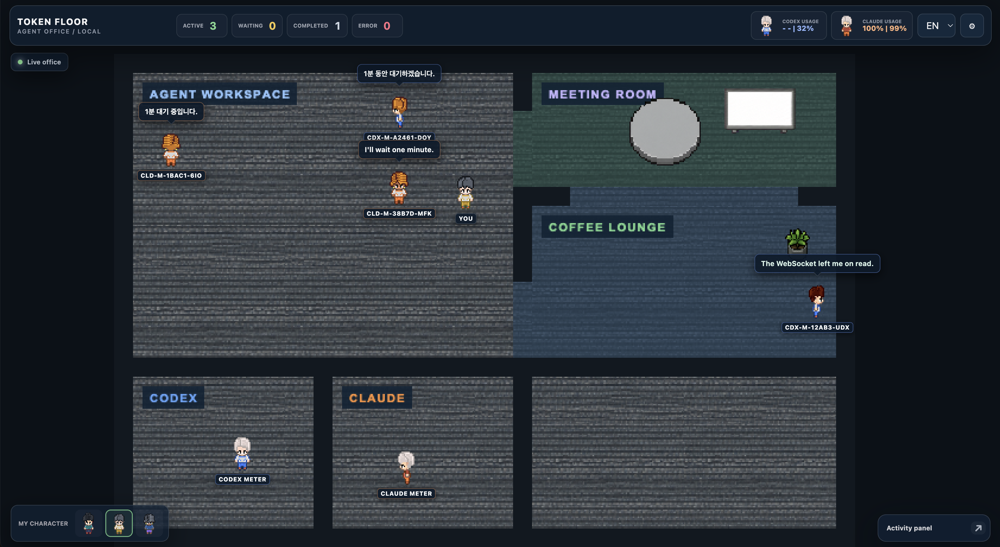
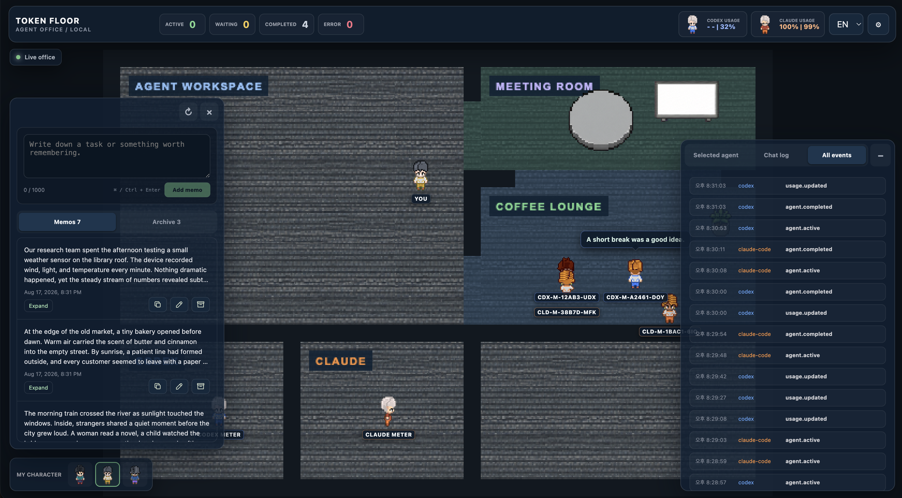

[English](../README.md) | [한국어](README.ko.md) | [日本語](README.ja.md)

# Token Floor

**追加ログインなしで、Claude Code と Codex のエージェントを一つのローカル・ピクセルオフィスに。**

Token Floor は、Claude Code と Codex がローカルに残すアクティビティを、ライブの見下ろし型オフィスとして表示します。どのエージェントが作業中か、入力や権限を待っているか、完了したか、エラーになったかを一目で確認できます。サニタイズ済みの会話とイベント、残り使用量を確認し、オフィスを歩き、会議室のホワイトボードにプロジェクトメモを残すこともできます。

Token Floor アカウント、プロバイダー OAuth 画面、API キー入力、Claude・Codex への再ログインは不要です。マシン上で設定済みのプロバイダーのローカル状態を `127.0.0.1` から読み取るため、軽量に始められます。プロバイダーの認証情報やツールの生 payload は Token Floor に保存しません。



_メインエージェントとサブエージェントは別々のキャラクターと作業位置を使い、完了したエージェントはラウンジで休憩します。_

## Token Floor を選ぶ理由

- **追加ログイン不要:** Token Floor アカウント、API キーのコピー、OAuth 同意、プロバイダーへの再ログインはありません。
- **ローカルファースト・読み取り専用:** プロバイダー所有ファイルはローカルでのみ読み、サーバーはループバックにバインドし、正規化済みランタイムデータは Git 対象外の `.token-floor/` に保管します。
- **二つのプロバイダーを一つの語彙で:** Claude と Codex の異なる記録を、サーバーや UI に渡す前に小さな共通ライフサイクル契約へ変換します。
- **端末ではなく、一目で分かるオフィス:** 状態、移動、吹き出し、使用量、ログ、メモを一つのコンパクトな画面で確認できます。
- **構造的な安全性:** 推論、生のプロバイダー記録、ツール入出力、認証情報、guardian アクティビティ、内部 orchestration メッセージを除外します。

## 機能

### ライブ・マルチプロバイダーオフィス

- Claude Code と Codex を同時に監視し、一方が未導入または一時的に異常でも、もう一方は継続して動作します。
- ヘッダーに作業中、待機中、完了、エラーのエージェント数を表示します。
- メインエージェント、サブエージェント、プロバイダー別の使用量 NPC を、異なる合成済みピクセルキャラクターで表現します。
- 安定したラベルと役割別の作業位置を割り当て、速度や停止時間の異なる直交ルートで衝突を避けて移動します。
- 完了したエージェントはコーヒーラウンジへ移動し、短いローカライズ済みの休憩フレーズを交代で表示します。
- ワークスペースでは吹き出しを維持し、サニタイズ済みアシスタントメッセージ、状態遷移、休憩フレーズの順に優先します。
- 完了キャラクターは 60 分保持し、再起動時に保持期限を過ぎたキャラクターは直ちに非表示にします。

### インタラクティブオフィス

- **WASD と矢印キー**の両方で、同じ四方向移動・向き判定を使ってプレイヤーを動かせます。
- パネル、タブ、メモ、ボタン、ホワイトボードにフォーカスがあっても、矢印キーは常にプレイヤーへ渡ります。WASD は文字入力中のみ入力欄を優先します。
- エージェントワークスペース、会議室、コーヒーラウンジ、Codex・Claude 専用使用量オフィス、将来用エリアからなるコンパクトな 5 ゾーン構成です。
- 壁、会議テーブル、ホワイトボードとの衝突、エージェントの迂回、深度ソート、カメラ追従、ホイールズーム、鮮明なニアレストネイバー描画に対応します。
- キャラクターピッカーと設定から複数のプレイヤーアバターを選択でき、選択内容はローカルに保存されます。
- オフィスへ入る前に必須ランタイムアートを確認し、不足時は壊れた画面ではなく確認すべきローカルアセットパスを案内します。

### エージェント詳細、チャット、イベント履歴

- キャラクターを選択すると、プロバイダー、状態、プロジェクト、セッション、最近の活動、待機・エラーの理由、親エージェントを詳細パネルで確認できます。
- **サニタイズ済みチャット**と**非チャットのライフサイクルイベント**を別タブ・別ログとして管理し、それぞれ最新 100 件まで保持します。
- 正規化済みログを SQLite に保存し、サーバー再起動後に復元します。ログ保持は 60 分のキャラクター保持とは独立しています。
- 重複レコードを冪等に処理し、古いイベントが新しい状態を巻き戻さないようにします。
- WebSocket の再接続中も最後の有効なオフィススナップショットを維持します。

### 信頼できるアクティビティ・完了判定

- Codex のタスク、メッセージ、サブエージェント、関数、MCP、カスタムツール、推論の境界をプロバイダー中立イベントへ変換します。
- `mcp_tool_call_begin`、`mcp_tool_call_end`、`agent_reasoning` を payload なしの active heartbeat として扱い、実際に稼働中の Codex エージェントが 5 分後に誤って完了扱いされることを防ぎます。
- 新しい活動がない状態で 5 分経過した場合にのみ完了を推定し、待機中または失敗したエージェントには完了 timeout を適用しません。
- 有効でも未対応のレコードは静かにスキップし、本当に壊れたソース状態だけを別途報告します。

### プロバイダーログイン不要の使用量メーター

- プロバイダー API や補助エージェントを使わず、プロバイダーがローカルに提供するレート制限メタデータを読み取ります。
- 5 時間・週間の残り比率、リセット情報、最終同期時刻、利用不可状態をそれぞれ表示します。
- ヘッダーの使用量カード、または分離オフィスのプロバイダー NPC から同じ詳細を開けます。
- Claude CLI・Desktop の対応ローカルソースから、最新かつ最も完全な有効サンプルを選びます。
- Codex の最近のローカル rollout レコードから使用量を収集します。
- ソースが欠落、ロック、部分書き込み、破損状態でも最後の正常値を維持し、正規化済み使用量だけをアトミックなローカルキャッシュへ書き込みます。

### ホワイトボードメモ

- 会議室のホワイトボードをクリックしてメモパネルを開き、もう一度クリックして閉じます。
- 最大 1,000 文字のメモを `Ctrl`/`Cmd` + `Enter` で追加でき、更新、展開・折りたたみ、コピーに対応します。
- 通常のメモは編集またはアーカイブできます。
- アーカイブ済みメモは復元または完全削除できます。通常のメモには削除操作を表示しません。
- バージョン付きメモ JSON を、Git 対象外の `.token-floor/memos.json` にアトミック保存します。

### 言語、設定、縮退運転

- UI は英語、韓国語、日本語に対応します。
- 言語とアバター設定をブラウザーのローカルストレージへ保存し、不正な値には安全な既定値を使います。
- アプリ接続と各プロバイダーの `healthy`、`waiting`、`missing`、`stale`、`malformed`、`disconnected` を独立して表示します。
- 認証情報やプロバイダーパスを UI で要求せず、機能情報と対応可能なローカルソース診断を提示します。

### プライバシー境界

Token Floor が保存するのは、オフィスに必要な許可リスト方式の正規化フィールドだけです。次のデータは意図的に除外します。

- Claude・Codex の生レコード
- 推論および chain-of-thought
- ツール引数、入力、出力、呼び出し payload、コマンド
- API キー、bearer token、環境シークレット、認証情報、ローカルユーザー名
- Claude sidechain、Codex guardian エージェント、内部 orchestration prompt
- チャット内のツール使用・結果ブロック

機密情報のサニタイズは保存前に適用し、古い SQLite 行を読み込む際にも再適用します。



_ホワイトボードメモとアクティビティパネルは、backdrop blur を使わない半透明のダークネイビー共通パネルを再利用しています。_

## Token Floor の実行

### 必要環境

- `node:sqlite` を含む Node.js 22 以上
- npm 10 以上
- 現在記載している Claude Desktop キャッシュパスは macOS 向けです。Claude Code と Codex のコレクターは利用可能なプロバイダー所有ローカル状態を読みます。

### パッケージ CLI

パッケージ公開後は、デフォルトコマンドと `start` は同じ動作です。

```bash
npx token-floor
npx token-floor start
npx token-floor --port 8080
TOKEN_FLOOR_PORT=8080 npx token-floor
```

Production UI、HTTP API、WebSocket は一つのループバック URL を共有します。ポートの優先順位は `--port` > `TOKEN_FLOOR_PORT` > `.token-floor/config.json` > `4317` です。

```bash
npx token-floor install --port 8080
npx token-floor diagnose --port 8080
npx token-floor uninstall
npx token-floor uninstall --delete-local-data
```

`install` は Claude が存在するときだけ Token Floor 所有 observer を追加します。`diagnose` は read-only です。`uninstall` は `--delete-local-data` を明示しない限り event・usage・memo を保持します。Claude のみ、Codex のみ、両方なしの環境をサポートします。

### 開発

```bash
git clone https://github.com/haesoo-y/token-floor.git
cd token-floor
npm install
npm run dev
```

[http://127.0.0.1:5173](http://127.0.0.1:5173) を開きます。ローカルコレクター・サーバーは `127.0.0.1:4317` で動作します。

開発 server port は `TOKEN_FLOOR_PORT`、Vite UI port は `npm run dev -w @token-floor/web -- --port 5174` で変更できます。Vite port を変える場合は `TOKEN_FLOOR_BROWSER_ORIGIN` もその UI origin に設定してください。

Token Floor は Claude や Codex へのログインを行いません。マシン上でプロバイダーを通常どおり設定すれば、そのプロバイダーが所有する既存のローカル状態を観察します。

ローカルコレクターの代わりに決定論的デモを起動する場合:

```bash
TOKEN_FLOOR_SIMULATION=true npm run dev
```

### 主なコマンド

```bash
npm run format:check
npm run lint
npm run typecheck
npm test
npm run build
```

## ローカルデータ

ランタイムファイルは Git 対象外の `.token-floor/` に保存されます。

| ファイル                           | 用途                                                                                 |
| ---------------------------------- | ------------------------------------------------------------------------------------ |
| `.token-floor/events.db`           | 再起動復元用の許可リスト方式による正規化済みライフサイクル・チャット・使用量イベント |
| `.token-floor/provider-usage.json` | アトミックに保存する正規化済み使用量キャッシュと最後の正常値                         |
| `.token-floor/memos.json`          | バージョン付きホワイトボードメモストア                                               |
| `.token-floor/config.json`         | Token Floor 所有の install port 設定                                                 |

Web UI が Claude や Codex のファイルを直接読むことはありません。完全なデータフローとセキュリティ境界は[アーキテクチャ文書](ARCHITECTURE.ja.md)を参照してください。

## プロジェクトパッケージ

| パッケージ                | 責務                                                                       |
| ------------------------- | -------------------------------------------------------------------------- |
| `packages/protocol`       | プロバイダー中立イベント、検証、サニタイズ、reducer、保持、メモ契約        |
| `packages/adapter-claude` | Claude hook、transcript 復元、ローカル使用量のデコード・正規化             |
| `packages/adapter-codex`  | Codex JSONL セッション・使用量のデコード・正規化                           |
| `packages/server`         | ループバック HTTP・WebSocket、コレクター、SQLite・JSON 永続化、maintenance |
| `packages/web`            | React UI、Phaser オフィス、パネル、設定、多言語、再接続                    |
| `packages/asset-contract` | ランタイムアセット manifest と検証契約                                     |
| `packages/cli`            | CLI parse、install・diagnose・uninstall ownership、production 起動         |

## アートクレジット

Token Floor のキャラクターとオフィスアートは、[CC0 1.0 Universal](https://creativecommons.org/publicdomain/zero/1.0/) で提供される JIK-A-4 の [MetroCity Free Top-Down Character Pack](https://jik-a-4.itch.io/metrocity-free-topdown-character-pack) を使用しています。ランタイムのキャラクターシートは、元のピクセルアートの方向性を保ちながらプロバイダーの役割に合わせて合成しています。再配布の詳細は [NOTICE](../NOTICE) を参照してください。

## ライセンス

Token Floor のソースコードは [MIT License](../LICENSE) で提供されます。サードパーティのアートワークは [NOTICE](../NOTICE) に別途記載しています。
